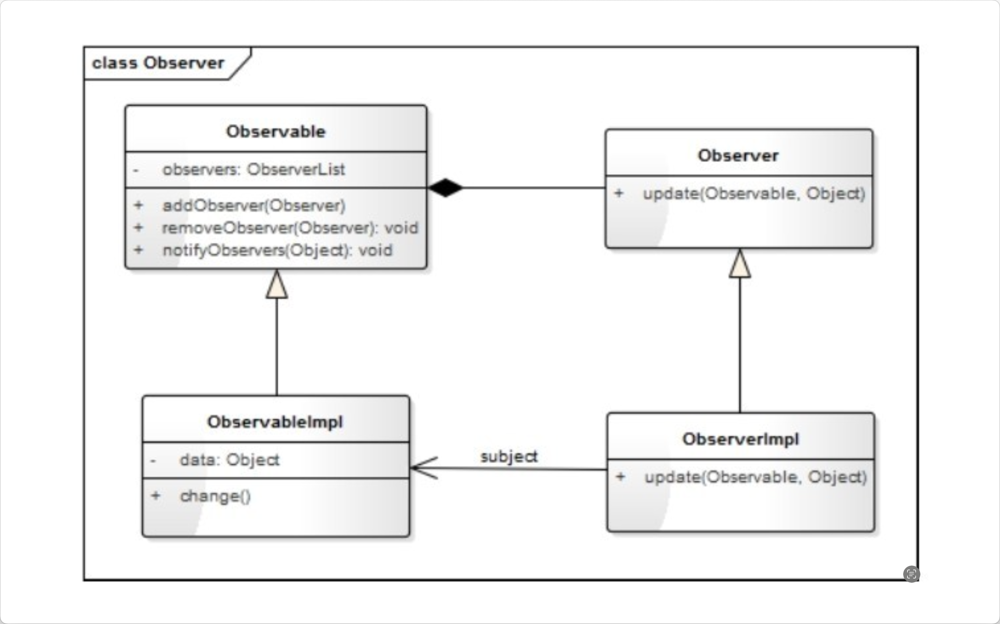
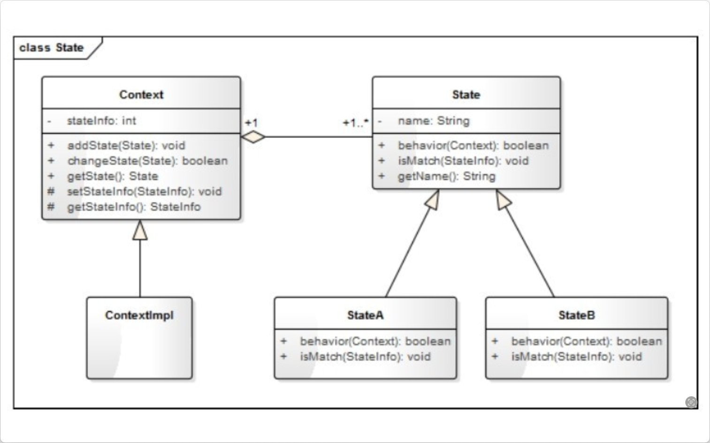
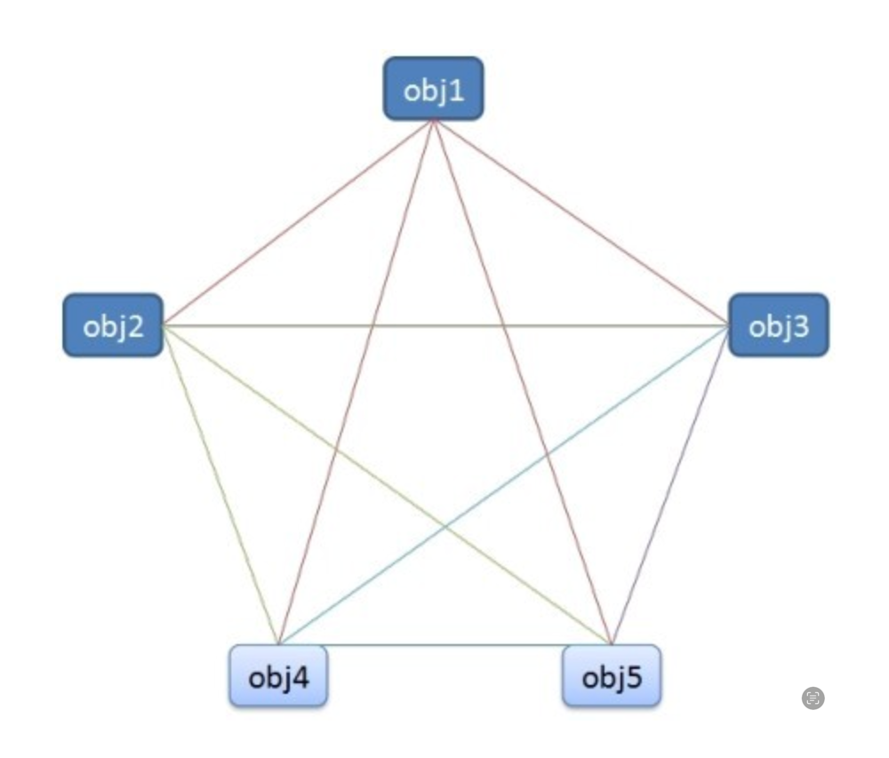
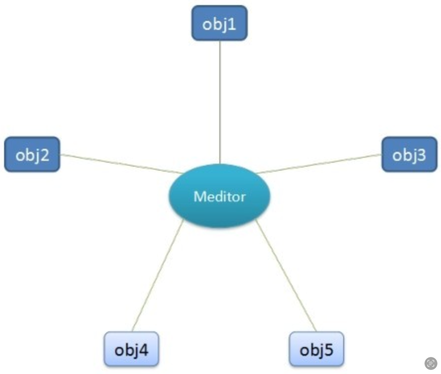
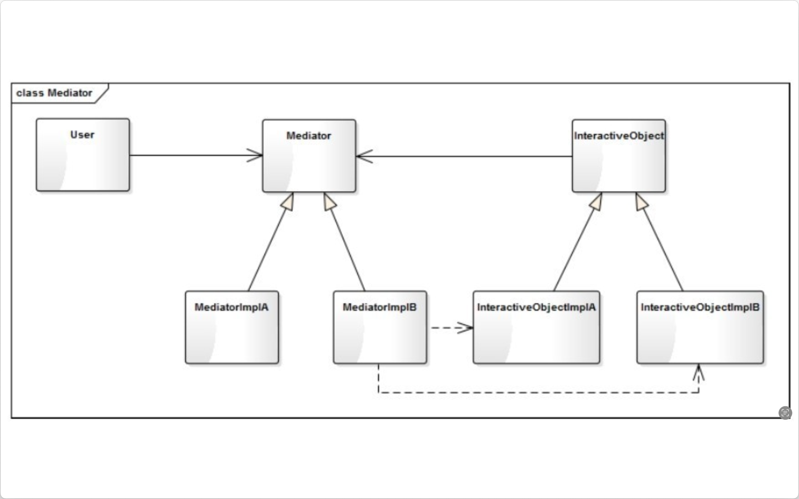
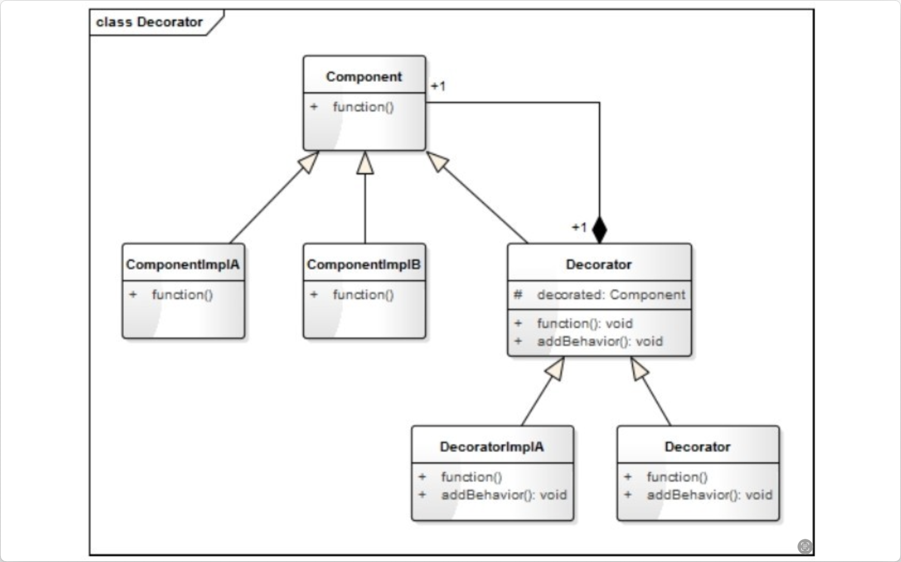

# Design Pattern
学习教材：《人人都懂设计模式》
## 监听模式
### 作用
在对象间定义一种一对多的依赖关系，当这个对象状态发生改变时，所有依赖它的对象都会被通知并自动更新。
### 类图

### 练习
1. 热水器-饮用模式&洗澡模式（water_heater.py）
2. 异常登陆（abnormal_login.py）
3. 新闻发布系统（news_release_system.py）
### 模型说明
1. 明确谁是观察者，谁是被观察者。一般，观察者和被观察者是多对一的关系。
2. 被观察者利用notify_observers()函数通知观察者时，无需指定具体的观察者，有观察者自己决定是否处理该通知。
    > 当然应该也可以屏蔽某个观察者
3. 被观察者需要能够添加和移除观察者观察者（add_observer(Observer), remove_observer(Observer)）。
4. 被观察者的实例化对象，需要在自身状态变化时（change()），通过父类通知给观察者（notify_observers）。
   > 如示例中的login()和set_temperature()函数
5. 推模型和拉模型
   1. 推模型 
      1. 被观察者将某些详细信息利用notify_observers(info)函数推送给观察者，再传递到update(info)函数，通过info变量传递。 
      2. info变量一般为object类型，即json｜字典。
   2. 拉模型
      1. 被观察者在通知观察者的时候，只传递少量信息。如果观察者需要更具体的信息，由观察者主动到被观察者对象中获取，相当于观察者从被观察者对象中拉数据。

### 个人理解&注意事项
1. 被观察者Observable，观察者Observer，对应各自的实例化对象。
2. 观察者对于被观察者是组合关系，因为没有被观察者的话，观察者就没有存在的必要。
3. 观察者不需要进行实例化，直接由被观察者的示例对象通过add_observer()函数添加。

## 状态模式
### 作用
允许一个对象在其内部状态发生改变时改变其行为，使这个对象看上去就像改变了它的类型一样。
### 类图

### 练习
1. 水💦的三态变化（water_states.py）
2. 交通信号灯🚥（traffic_lights）
### 模型说明
1. 有时状态模式的实现场景会很复杂，决定状态的因素也很多，故而可以将决定状态变化的属性单独抽象成一个类StateInfo，这样is_match可以传入更多的信息。
2. 每种状态只有一种实例。
3. 优缺点：
   1. 优点：
      + 封装了状态的转换规则，在状态模式中可以将状态的转换代码封装在环境类中，对状态转换代码进行集中管理，而不是分散在一个个业务逻辑中。
      + 将某一个状态封装为类（仅有一个实例），能够专注于某个状态的逻辑开发。
      + 状态转化逻辑与状态对象合为一体，使用时仅需要注入一个不同的状态对象即可使环境对象拥有不同的行为。
        > 当需要实现一个新的状态对象时，仅需要在对象初始化时添加一个新的状态即可，一体化。
   2. 缺点
      + 类和对象的个数增多
        + 状态模式的结构实现比较复杂，使用不当会导致程序结构和代码的混乱。
### 个人理解&注意事项
1. 一个对象的行为由状态决定，且在运行时该对象的状态会经常改变。
2. 使用条件：多分支的条件判断语句，每个分支依赖于对象的状态，⚠️每个分支的业务逻辑非常复杂时，使用状态模式拆分不同的条件分支。
3. 单例模式见后续。

## 中介模式
### 作用
用一个中介对象来封装一系列的对象交互，中介者使各对象不需要显式地相互引用，从而使其耦合松散，而且可以独立地改变它们之间的交互。

在很多系统中，多个类很容易相互耦合，形成网状结构。中介模式的作用就是将网状结构分离成星型结构。这样调整之后，使得对象间的结构更加简洁，交互更加顺畅。

网状结构

星链结构

### 类图

### 练习
1. 房屋中介（housing_agency.py）
2. 设备管理器（devices_manager.py)
### 模型说明
1. Mediator为中介类，用来协调对象间的交互，如HouseAgency等，中介类也可以有多个具体的实现类。
2. InteractiveObject是进行交互的对象，可以是互不想干的多个类的对象，如HouseOwner和Customer（不准确描述），也可以是具有继承关系的相似类。
3. 优缺点：
   1. 优点
      + 将原本分布于多个对象间的行为集中在一起，作为一个独立的概念并将其封装在一个对象（Meditor）中，简化了对象（InteractiveObject）之间的交互。
      + 将原本多个对象多对多的关系转换为一对多的关系，更加易于理解、维护和拓展。
   2. 缺点
      + 中介者承接了所有的交互逻辑，交互的复杂度转变成了中介者的复杂度，中介者类会变得越来越庞大和复杂，以至于难以维护。

### 个人理解&注意事项

## 装饰模式
动态的给一个对象增加一些额外的指责，就拓展对象功能来说，装饰模式比生成子类的方法更为灵活。

### 作用

### 类图

右下角应该为DecoratorImplB，非Decorator。
### 练习
1. 人物装饰（clothing.py）
2. 画形状（draw_shape.py）
### 模型说明
1. 动态的给一个对象添加一些额外的职责。
### 个人理解&注意事项
1. 理解的灵魂之处在于：装饰器的抽象基类是被装饰对象的子类，且其成员变量为被装饰对象。
2. 不需要增加子类，来拓展对象的功能。而且装饰类和被装饰类可以独立发展，不会相互耦合。
### 拓展（了解）
在python中一切都是对象，可以将一个函数作为参数传递给另一个函数，也可以将一个类作为参数传递给一个函数。
1. Python中函数的特殊功能
   + python函数：可以作为一个参数传递给另一个函数，可以在函数内部再定义函数，也可以在函数中返回一个函数。
2. 装饰器修饰函数
   + 包装一个函数，并改变（拓展）它的行为